# Approov WebView Quickstart for Android (Java)

Provides instructions on how to effectively protect Android `WebView` using the Approov SDK, including Approov Dynamic Pinning.

The quickstart is designed for WebView apps that need Approov protection on:

1. `fetch(...)`
2. `XMLHttpRequest`
3. current-frame HTML form submission

The demo page calls `https://shapes.approov.io/v2/shapes`, which also requires the API key `yXClypapWNHIifHUWmBIyPFAm`. The API key is injected natively so the page never needs to know it.

## Why This Architecture

Android `WebView` does not provide a supported API for mutating headers on arbitrary built-in `https://` page requests before they leave the WebView networking stack.

Because of that, the safe approach is:

1. Inject a JavaScript bridge at document start.
2. Intercept Fetch, XHR, and current-frame form submission inside the page.
3. Forward those requests into native Java with `WebViewCompat.addWebMessageListener(...)`.
4. Sync WebView cookies into native OkHttp before the request is sent.
5. Ask Approov for a JWT in native code through the Approov OkHttp wrapper.
6. Add the `approov-token` header in native code.
7. Inject any native-only secrets, such as API keys, in native code.
8. Execute the request natively with an Approov-protected `OkHttpClient`.
9. Let Approov dynamic pinning validate the TLS connection.
10. Sync response cookies back into the WebView cookie store.
11. Return the response back to JavaScript or, for form navigations, render the response back into the current document.

## Architecture Flow

```mermaid
flowchart LR
    subgraph Web["Trusted WebView Page"]
        Page["HTML / app JavaScript"]
        Bridge["approov-webview-bridge.js"]
    end

    subgraph Native["Android Native Layer"]
        Listener["WebViewCompat.addWebMessageListener(...)"]
        Support["ApproovWebViewSupport"]
        CookieSync["Cookie sync with CookieManager"]
        Client["Approov-protected OkHttpClient"]
    end

    subgraph Remote["Remote Services"]
        Approov["Approov SDK integration"]
        API["Protected API"]
    end

    Page -->|"fetch / XHR / form submit"| Bridge
    Bridge -->|"JSON request envelope"| Listener
    Listener --> Support
    Support -->|"copy cookies into native request"| CookieSync
    CookieSync --> Client
    Support -->|"inject secret headers"| Client
    Client -->|"request Approov token"| Approov
    Approov -->|"approov-token + dynamic pinning"| Client
    Client -->|"HTTPS request"| API
    API -->|"HTTP response + Set-Cookie"| Client
    Client --> CookieSync
    Support -->|"JSON response envelope or HTML body"| Bridge
    Bridge -->|"Response object or rendered document"| Page
```



## Comparison With Other Approaches

| Approach | What it does well | Main downside | Best fit |
| --- | --- | --- | --- |
| Current approach: document-start JS interception + scoped WebMessage bridge + native `OkHttp` | Works with public Android APIs, keeps secrets native, supports `fetch`, XHR, and same-frame forms | Does not transparently cover every browser network primitive | Hybrid apps where page code owns protected API traffic |
| `WebViewClient.shouldInterceptRequest(...)` proxying | Useful for asset serving, custom responses, and some inspection | Not a reliable way to mutate arbitrary outgoing headers before the WebView stack sends them (see more below) | Static assets, offline content, or narrow resource interception |
| `addJavascriptInterface(...)` bridge | Simpler to wire up on older examples | Larger attack surface and weaker trust scoping than origin-scoped WebMessage listeners | Legacy compatibility only |
| Same-origin backend/BFF or reverse proxy | Preserves normal browser behavior and covers subresources, redirects, Service Workers, and WebSockets better | Requires server-side infrastructure and operational ownership | Apps that need full browser semantics for protected traffic |
| Native UI + native networking only | Strongest control over networking and security policy | Gives up most WebView reuse and increases rewrite cost | Products that are primarily native rather than hybrid |

### More about `shouldInterceptRequest(...)` approach

`WebViewClient.shouldInterceptRequest(...)` is a response replacement hook, not a request mutation hook.

- the callback gives us request metadata such as URL, method, and headers, but not a general way to edit the request and let the WebView continue sending it with extra headers
- if we need to add `approov-token` or an API key, you usually end up re-executing the request yourself in native code and returning a synthetic `WebResourceResponse`
- `WebResourceRequest` does not expose a general request body, so faithfully replaying arbitrary POST-style traffic is already incomplete..
- `shouldInterceptRequest(...)` is only called for the initial URL in a redirect chain, while `WebResourceResponse` does not support causing a redirect with a `3xx` status code
- Service Worker traffic uses a separate API surface (`ServiceWorkerController` / `ServiceWorkerClient`), so one hook does not cover all browser-managed networking

If we proxy the request ourself, we are no longer "adding a header to the browser request". We are implementing a parallel browser transport and trying to map its result back into WebView. Browser semantics such as redirects, streaming, progress, cancellation, cookie behavior, and some scheme-specific behavior stop being native WebView behavior unless we would re-create them ourselfes but this seem to be a complex and prone to errors. 

## What This Quickstart Covers

The reusable bridge in `app/src/main/java/approov/io/webviewjava/approovwebview/ApproovWebViewSupport.java` and `app/src/main/assets/approov-webview-bridge.js` covers:

- `fetch`
- `XMLHttpRequest`
- `form.submit()`
- user-driven HTML form submission
- cookie synchronization between `CookieManager` and native OkHttp
- dynamic pinning
- native-only secret header injection
- local HTTPS content through `WebViewAssetLoader`

That makes it suitable for the common WebView app pattern where:

- the UI lives in web content
- protected business APIs are called with Fetch/XHR
- some flows still rely on standard HTML forms

## Platform Limitations For Public Android WebView APIs

Even with a strong bridge, public Android WebView APIs still do not let an app transparently mutate headers on:

- arbitrary `` requests
- arbitrary `<script>` requests
- arbitrary `<iframe>` resource requests
- arbitrary CSS subresource requests
- WebSockets
- Service Worker networking
- forms targeting another window or named frame
- multipart file-upload form submissions
- every browser semantic detail such as Fetch abort signals and XHR progress streaming

The safest production patterns are:

- keep protected API traffic on Fetch, XHR, or current-frame form submission
- keep static assets and page documents unprotected by Approov if they must be loaded by WebView directly
- or route protected browser traffic through a same-origin backend/BFF that your WebView can call normally

## Project Structure

- `app/src/main/java/approov/io/webviewjava/approovwebview/ApproovWebViewSupport.java`
  - Reusable bridge code.
  - This is the main file to copy into another app.
- `app/src/main/java/approov/io/webviewjava/approovwebview/ApproovWebViewConfig.java`
  - Reusable bridge configuration.
- `app/src/main/java/approov/io/webviewjava/approovwebview/ApproovWebViewSecretHeader.java`
  - Reusable native-only secret header rules.
- `app/src/main/java/approov/io/webviewjava/WebViewJavaApplication.java`
  - Demo-specific configuration.
  - This is the file most adopters should edit first.
- `app/src/main/java/approov/io/webviewjava/MainActivity.java`
  - Minimal Android host activity.
- `app/src/main/assets/index.html`
  - Local demo page loaded into the WebView.
  - Demonstrates both `fetch()` and real HTML form submission.
- `app/src/main/assets/approov-webview-bridge.js`
  - Document-start JavaScript bridge injected into trusted pages.

## Production Notes

### 1. Form submission support is explicit

The bridge now intercepts:

- user form submission
- `form.submit()`

For standard same-frame form navigations, the native layer executes the request and then writes the response HTML back into the current document.

Forms targeting another frame or window are intentionally left on the normal WebView path.

Multipart file uploads are also intentionally left on the normal WebView path.

### 2. Dynamic pinning comes from the Approov OkHttp wrapper

This sample uses:

- `ApproovService.getOkHttpClient()`

That client includes:

- Approov token injection
- Approov dynamic pinning

The relevant request execution path is in:

- `ApproovWebViewSupport.executeRequest(...)`

### 3. Cookie continuity is implemented in this sample

The native proxy mirrors cookies between:

- WebView's cookie store
- native OkHttp

That is important for login, session, and CSRF-sensitive flows once requests leave WebView and run through native networking.

### 4. Fail-open versus fail-closed is configurable

This sample defaults to fail-open behavior:

- if Approov cannot initialize, the request can still proceed without `approov-token`
- if Approov networking fails after initialization, `ApproovService.setProceedOnNetworkFail(true)` allows the request to proceed

That behavior is controlled by:

- `setAllowRequestsWithoutApproov(...)` in `ApproovWebViewConfig.Builder`

For a stricter production deployment, set it to `false`.

## What You Still Need To Do

The project builds as-is, but Approov will only issue valid JWTs when the account and app are configured correctly.

1. Add the protected API domain to Approov.

```bash
approov api -add shapes.approov.io
```

2. Ensure the backend validates Approov tokens.

If you adapt this quickstart to your own backend, the server must validate the JWT presented on the `approov-token` header.

3. Register the Android app in Approov and obtain the initial configuration string.

4. If you are testing on an emulator or other development device, create and configure an Approov development key if required by your account setup.

5. Replace the demo values in:

- `app/build.gradle.kts`
- `app/src/main/java/approov/io/webviewjava/WebViewJavaApplication.java`

In particular:

- `approov.config`
- `approov.devKey`
- `shapes.apiKey`
- `BuildConfig.SHAPES_API_URL`
- secret-header matching rules
- allowed origin rules

## Reusing the Bridge in Another App

### 1. Add the dependencies

This project uses:

- `io.approov:service.okhttp`
- `com.squareup.okhttp3:okhttp`
- `androidx.webkit:webkit`

### 2. Copy the bridge files

Copy:

- `app/src/main/java/approov/io/webviewjava/approovwebview/ApproovWebViewSupport.java`
- `app/src/main/java/approov/io/webviewjava/approovwebview/ApproovWebViewConfig.java`
- `app/src/main/java/approov/io/webviewjava/approovwebview/ApproovWebViewSecretHeader.java`
- `app/src/main/assets/approov-webview-bridge.js`

### 3. Create your own configuration

Example:

```java
ApproovWebViewConfig config = new ApproovWebViewConfig.Builder(BuildConfig.APPROOV_CONFIG)
    .setApproovDevKey(BuildConfig.APPROOV_DEV_KEY)
    .setApproovTokenHeaderName("approov-token")
    .setAllowRequestsWithoutApproov(true)
    .addAllowedOriginRule(ApproovWebViewSupport.LOCAL_ASSET_ORIGIN)
    .addAllowedOriginRule("https://your-web-app.example.com")
    .addSecretHeader(new ApproovWebViewSecretHeader(
        "api.example.com",
        "/v1/",
        "x-api-key",
        BuildConfig.EXAMPLE_API_KEY
    ))
    .build();

ApproovWebViewSupport.initialize(this, config);
```

### 4. Present the WebView

```java
ApproovWebViewSupport approovWebViewSupport = ApproovWebViewSupport.getInstance();
approovWebViewSupport.configureWebView(webView);
webView.setWebViewClient(approovWebViewSupport.buildWebViewClient(null));
webView.loadUrl(approovWebViewSupport.getAssetUrl("index.html"));
```

Or load a trusted remote page:

```java
ApproovWebViewSupport approovWebViewSupport = ApproovWebViewSupport.getInstance();
approovWebViewSupport.configureWebView(webView);
webView.setWebViewClient(approovWebViewSupport.buildWebViewClient(null));
webView.loadUrl("https://your-web-app.example.com");
```

## Best Practices

- Prefer a strict allowlist in `addAllowedOriginRule(...)`.
- Keep native-only secrets in `ApproovWebViewSecretHeader`, never in page JavaScript.
- Keep protected endpoints on Fetch, XHR, or current-frame form submission.
- Keep cookie synchronization enabled if your app depends on authenticated browser state.
- Keep local demo pages on `https://appassets.androidplatform.net` instead of `file:///android_asset/...`.
- Set `setAllowRequestsWithoutApproov(false)` for production unless you intentionally need fail-open behavior.

## Build

The project builds with Java 21:

```bash
export JAVA_HOME=$(/usr/libexec/java_home -v 21)
export PATH="$JAVA_HOME/bin:$PATH"
./gradlew assembleDebug
```

The output APK is:

- `app/build/outputs/apk/debug/app-debug.apk`

## Sources

- [Approov iOS WebView quickstart reference style](https://github.com/approov/quickstart-ios-webkit-webview-urlsession)
- [Approov Android OkHttp Quickstart Reference](https://github.com/approov/quickstart-android-kotlin-okhttp/blob/master/REFERENCE.md)
- [Approov Shapes Example](https://github.com/approov/quickstart-android-kotlin-okhttp/blob/master/SHAPES-EXAMPLE.md)
- [AndroidX WebKit `addDocumentStartJavaScript`](https://developer.android.com/reference/androidx/webkit/WebViewCompat)
- [AndroidX WebKit `addWebMessageListener`](https://developer.android.com/reference/androidx/webkit/WebViewCompat)
- [AndroidX `WebViewAssetLoader`](https://developer.android.com/reference/androidx/webkit/WebViewAssetLoader)
